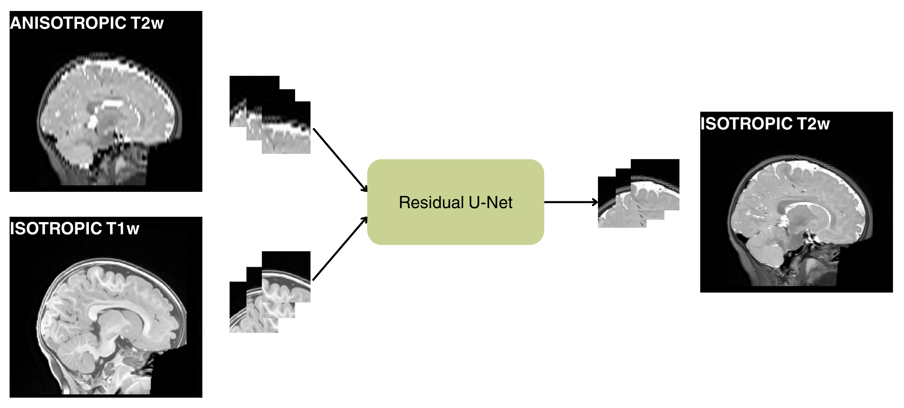

# BABY-AI: Anisotropic to Isotropic Reconstruction of Infant Brain MRI with Deep Learning

This repo contains the code to reconstruct anisotropic T2w infant brain MRI to isotropic. The repository can either be used to perform direct inference with a pretrained model, or to perform training on a new dataset. The project was initially conducted as a Master's Thesis at the Mathematical Faculty at Lund University by Alma Lennartsson.

Master's thesis available at: [Anisotropic to Isotropic Reconstruction of Infant Brain MRI with Deep Learning](link to lup). 

### Acknowledgements

- This model builds upon the [Residual U-Net](https://github.com/Project-MONAI/MONAI/blob/dev/monai/networks/nets/unet.py) by MONAI.
- The data used to train the model is from [The Baby Open Brain's Repository](https://bobsrepository.readthedocs.io/) by <u>Feczko</u> et al.

## Overview



The BABY-AI model operates on 3D MRI and is trained with a supervised, patch-based approach. It takes two inputs, the anisotropic T2w MRI and the isotropic T1w MRI, and outputs the reconstructed isotropic T2w MRI. The available pretrained weights are trained on infant brain data from [The Baby Open Brain's Repository](https://bobsrepository.readthedocs.io/) with additional augmentations, resulting in a total of 720 training images. The augmentations include synthesized anisotropic MRI with slice thickness of 2mm, 3mm, 4mm and 5mm, in three varying directions (axial, coronal, sagittal).

Model specifications and hyperparameters are presented in [Anisotropic to Isotropic Reconstruction of Infant Brain MRI with Deep Learning](link to lup).

### Quick guide
To use the model, first ensure that all MRI data is rigidly registered to the MRI atlas available in `preprocessing.py`. For a quick tutorial, use `demo.py`, which reconstrcuts one single anisotropic MRI. To reconstrcut several images, use `inference.py`. To train the model on new data, use `training.py`. To create more training data by synthesizing anisotropic MRI from isotropic MRI, use `synthesize_anisotropic`. 

## Structure

```bash
project/
├── README.md                       # This file
├── results/                        # Results are stored here
├── scripts/   
│   ├── func/                    
│   │   ├── dataset.py              # Implemenation of the dataloder
│   │   └── functions.py            # Help functions                     
│   ├── inference.py                # To reconstruct several images from anisotropic to isotropic
│   ├── preprocessing.py            # To download the MRI atlas from Huggingface hub
│   ├── synthesize_anisotropic.py   # To generate more training data, creates anisotropic images from isotropic images
│   └── training.py                 # To train the model on new data
├── demo.ipynb                      # An easy-to-follow Jupyter notebook which inputs an anisotropic MRI and outputs the isotropic version of it
├── requirements.txt                # Requirements needed for all scripts except training.py
└── requirements_training.txt       # Requirements needed for training.py
```

## Files

Files are available via Huggingface hub and automatically loads in the scripts. The nifti files are from [The Baby Open Brain's Repository](https://bobsrepository.readthedocs.io/)

- `pretrained_weights.pth`is used for inference
- `infant_atlas.nii.gz` is used to coregister the data
- `demo_t2w_input.nii.gz` anisotropic T2w MRI (slice thickness 4mm in axial direction)
- `demo_t1w_input.nii.gz` isotropic T1w MRI

## Installation

The repo requires different virtual environment setups depending on if it will be used for training or not. If training is performed with the `training.py` script, a conda environment with `requirments_training.txt` is required. This setup requires GPU power and was performed on a HPC cluster during development. The training can take along time, even on a HPC cluster. 

In all other cases, a python environment with `requirements.txt` works well. This setup only requires CPU power, and most scripts are realtively fast.

**For CPU use** 
1. Clone the repo.
2. Set up a python virtual environment and install `requirements.txt` :

```console
python -m venv .venv
source .venv/bin/activate
pip install -r requirements.txt
```

**Training/GPU use**  
1. Clone the repo or copy the files needed.
2. Set up a conda environment and install `requirements_training.txt`.
```console
conda create -n train_env python=3.10
conda activate train_env
pip install -r requirements_training.txt
```

## Usage

### Preprocessing
To use any of the scripts in this repo, a prior preprocessing of your data has to be performed. All MRI data to be used has to fullfill these requirements:

- Have size (182, 218, 182) mm.
- Have voxel size (1, 1, 1) mm.
- Rigidly registered to `infant_atlas.nii.gz`:
    1. Change `local_dir` in `preprocessing.py` to your desired data path
    2. Run `preprocessing.py`
    ```console
    python preprocessing.py
    ```
    3. Rigidly register all your images to the downloaded atlas by using any desired coregistration method.
- Anisotropic images should be interpolated with cubic spline interpolation to get the correct shape.

### Demo
Start with running the `demo.ipynb` script which is a step-by-step jupyter notebook. In the first cell, which says `---EDIT THIS PART---`, you need to specify some paths. When that is done, it is possible to run each cell in the notebook and get an reconstructed isotropic MRI. The isotropic MRI is stored under `results/` as a nifti file.

### Inference
The `inference.py` script can reconstrcut several anisotropic T2w infant brain MRI to isotropic. 
1. Start with specifying `DATA_DIR` as your directory to the folder containing the MRI data, and `REPO_ROOT` as the directory of this repository. 
2. Ensure that
```console
t1_files = sorted(DATA_DIR.rglob("*T1w.nii.gz")) # isotropic t1w images
t2_lr_files = sorted(DATA_DIR.rglob("*T2w.nii.gz")) # anisotropic t2w images
```
are loaded correctly, so that the lists store the paths to the isotropic t1w images and the anisotropic t2w images in the same order.

3. Run the script
```console
python inference.py
```
4. Results are stored under `results/`


### Training

Shift to the conda environment `train_env` for this part, preferably on a HPC cluster.
1. Adjust paths and ensure correct data loading in `training.py`
2. Be aware that the training script itself automatically performs the train/val/test split. Adjust this if needed, otherwise make sure to use the same test split when performing inference later on.
2. Run the script either from terminal or with a batch script.
3. The results are stored under `results/` 
    - `training_info.csv` with all details from the training process
    - `weights/` stores the weights specified with a timestamp
    - `tensorboard_logs/`stores the tensorboard outputs and is available at:
    ```console
    tensorboard --logdir=/path/to/specific/tenosrboard/file
    ```

**Inference on retrained mdodel**

After retraining the model, redo the inference with your new model weights.
1. Adjust the `model_weights` variable in `inference.py`
2. Run the inference on your test dataset

### Augmentation

To create a more generalized model, augmentations were used to train the pretrained model. The augmentations in this case is training data with more types of anisotropy/slice thickness. If you wish to do this to your own data, use the script `synthesize_anisotropic.py`. The script will use your available ground truth isotropic MRI so create anisotropic versions of them.

Implement the augmentations in the training procedure to receive a more generelizable model. 


